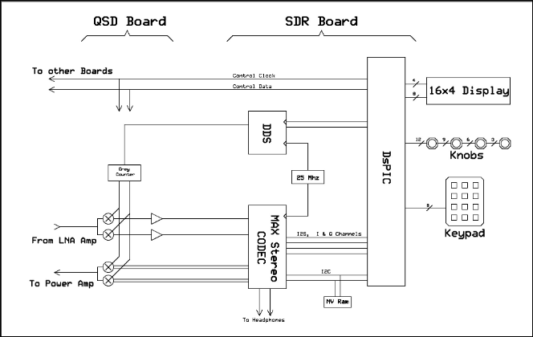
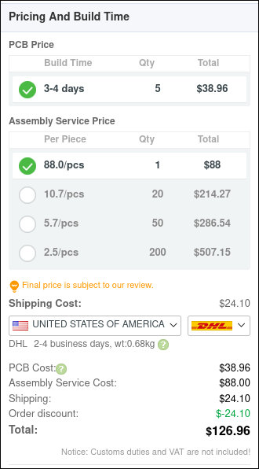

# Project Name Here

I got my amateur radio license late last year, and have been itching to use it more since then. I've decided this summer to work more on using it, but to that extent I need a radio. CW (morse code) seems pretty interesting, and working on the long range HF bands seems like a fun challenge, so I decided to build a 5w CW Software Defined Radio based off the RP2350 chip.

## May 14

Highway kicked off today, and with it come many new projects.
I've never built any kind of RF device before, so this is entirely new territory for me.
I decided to do some research into the general design of a transceiver.
The first thing that I've found is a series of schematics from [QRP-Labs](https://qrp-labs.com/) that details their QCX-mini transceiver. I then found a series by HAM operator Ward Harriman, AE6TY, [detailing the design of a QRP SDR](https://www.ae6ty.com/wp-content/uploads/2024/06/QRP-SDR-1a.pdf) which I have a feeling I'll be utilizing frequently.

In his guide, he details a block diagram which I'm going to reference for my own board. The design I intend to use will have four main parts:

1. The MCU, which will handle all the digital signal processing, IO to a display, key, etc.
2. A "Tayloe" Detector, which will convert the RF received from the antenna into an I and Q analog input on the RP2350
3. Filters, of some sort, on the transmit and receive (IDK I'm not an RF engineer).
4. An amplifier on the transmit end, to bump the power up to 5W.

There will probably be other features, like a Li-Ion battery charger, but my final idea is somewhere inbetween the [QRP QCX-mini](https://qrp-labs.com/qcxmini.html) and the [HF Signals zBitx](https://www.hfsignals.com/index.php/zbitx/).

## May 15th

Now that I've found some resources, I need to begin to plan my transceiver. The part that I'm most unsure of right now is filters and amplifiers, what I'll need for both and how they work. Looking at both the QCX-mini and the [Pi-Pico RX](https://101-things.readthedocs.io/en/latest/radio_receiver.html) on the receiving end I'll need a band-pass filter, so I'm going to spend some time learning how one works. After doing some research, a band-pass filter simply filters out frequencies that are either too high or two low based on a certain range of frequencies. I'm going to be making a single band transceiver, so I'll be opting for the 10M band. As an extra bonus, I had to fix kicad segmentation faulting when I tried to run it on Wayland with a Nvidia GPU :3.

**Update after almost 4 hours of research**
My initial plan was do to a custom RP2350 circuit rather than using an existing MCU like the Pi Pico 2, however PCBWay PCBA costs are far more than I expected, so I will sadly have to scrap that idea and look for solely THT or large footprint SMD components.

This does mean that my plan of using the SI5351A clock generator is in trouble, but thankfully Adafruit has a breakout board with the clock generator as a THT part. With these developments, my goal now is to use entirely THT parts for this PCB.
